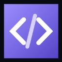

# <p align="center">CollabCode</p>

<p align="center">
  
</p>

<p align="center">
  <strong>Production-ready Real-Time Classroom Coding Intelligence Platform</strong>
</p>

<p align="center">
  Empowering educators and students with live collaborative coding, private assistance, classroom analytics, and intelligent learning—all in one platform.
</p>

<p align="center">


</p>

---

# Live Deployments

## Dashboard

https://collabcode-dashboard.vercel.app

## Student Portal

https://collabcode-student.vercel.app

## VS Code Extension

Install directly from the Visual Studio Code Marketplace:

https://marketplace.visualstudio.com/items?itemName=niteshnd.collabcode-vscode

Or simply open **Visual Studio Code**, navigate to the **Extensions** tab, search for:

```
CollabCode Classroom
```

and click **Install**.

---

# What is CollabCode?

CollabCode is a complete classroom coding platform designed for universities, coding bootcamps, schools, and online learning.

Unlike ordinary screen sharing, CollabCode allows instructors to monitor live coding sessions, assist students privately, replay classroom activity, export learning progress, and manage multiple classrooms simultaneously.

Everything happens in real time using WebSockets and integrates directly into Visual Studio Code.

---

# Features

## Real-Time Classroom Collaboration

Students and instructors stay synchronized instantly.

- Live coding updates
- Presence indicators
- Real-time communication
- Session synchronization

---

## VS Code Extension

Students never need to leave VS Code.

The extension provides:

- Join Classroom
- Leave Classroom
- Private Help Requests
- Live Hint Panel
- Session Export
- Automatic Synchronization

Install directly from:

https://marketplace.visualstudio.com/items?itemName=niteshnd.collabcode-vscode

---

## Instructor Dashboard

Modern instructor dashboard featuring

- Live classrooms
- Student monitoring
- Progress tracking
- Classroom analytics
- Teaching moments
- Replay timeline
- Export reports
- Smart pairing
- Session management

---

## Student Portal

Public React application allowing students to

- Join classrooms
- Authenticate securely
- View classroom status
- Access learning sessions

---

## AI Assistance

Optional Gemini integration provides

- Intelligent hints
- Socratic guidance
- Context-aware suggestions
- Deterministic fallback mode

---

## Multiple Classrooms

Supports

- Multiple instructors
- Multiple classrooms
- Multiple concurrent students
- Independent room ownership
- Co-instructors
- Secure authentication

---

## Privacy First

No fake classroom data.

The simulator only joins active rooms for testing.

All production data belongs to authenticated classrooms.

---

# Architecture

```
                        +----------------------+
                        | Instructor Dashboard |
                        | React + Vite         |
                        +----------+-----------+
                                   |
                                   |
                         Socket.IO / REST API
                                   |
                      +------------+-------------+
                      |     Express Backend      |
                      |      Socket.IO API       |
                      +------------+-------------+
                                   |
                 +-----------------+------------------+
                 |                                    |
          Supabase PostgreSQL                 Gemini AI
                 |                                    |
                 +-----------------+------------------+
                                   |
                           VS Code Extension
                                   |
                           Student Portal
```

---

# Tech Stack

## Frontend

- React
- Vite
- TypeScript
- Tailwind CSS

## Backend

- Node.js
- Express
- Socket.IO

## Database

- Supabase PostgreSQL

## Authentication

- Supabase Auth

## AI

- Google Gemini API
- Deterministic Socratic Fallback

## VS Code

- VS Code Extension API

---

# Repository Structure

```
CollabCode

packages/
│
├── dashboard
│
├── extension
│
├── server
│
├── shared
│
├── student-portal
│
└── sim
```

---

# Getting Started

## Clone

```bash
git clone https://github.com/Nitesh-N-D/CollabCode.git

cd CollabCode
```

---

## Install

```bash
pnpm install
```

---

## Build

```bash
pnpm build
```

---

## Start Development

```bash
pnpm dev
```

---

# Install the VS Code Extension

### Option 1 (Recommended)

Open Visual Studio Code

Go to

```
Extensions
```

Search

```
CollabCode Classroom
```

Click

```
Install
```

Marketplace

https://marketplace.visualstudio.com/items?itemName=niteshnd.collabcode-vscode

---

### Option 2

Download the VSIX from Releases

Install manually using

```
Extensions
→
Install from VSIX
```

---

# Documentation

Deployment guide

```
RUNBOOK.md
```

Publishing guide

```
EXTENSION_PUBLISHING.md
```

---

# Roadmap

- AI Classroom Analytics
- Session Replay
- Live Code Playback
- Assignment Tracking
- Attendance Reports
- Classroom Insights
- Student Performance Analytics
- Smart Pair Programming
- Classroom Recording
- Code Review Mode

---

# Contributing

Contributions are welcome.

1. Fork the repository

2. Create a feature branch

```bash
git checkout -b feature/amazing-feature
```

3. Commit

```bash
git commit -m "Add amazing feature"
```

4. Push

```bash
git push origin feature/amazing-feature
```

5. Open a Pull Request

---

# Links

## GitHub

https://github.com/Nitesh-N-D/CollabCode

## Dashboard

https://collabcode-dashboard.vercel.app

## Student Portal

https://collabcode-student.vercel.app

## VS Code Marketplace

https://marketplace.visualstudio.com/items?itemName=niteshnd.collabcode-vscode

## Issues

https://github.com/Nitesh-N-D/CollabCode/issues

---

# License

Licensed under the MIT License.

---

<p align="center">

### ⭐ If you found this project useful, please consider giving it a star!

Built with ❤️ by **Nitesh N.D**

</p>
